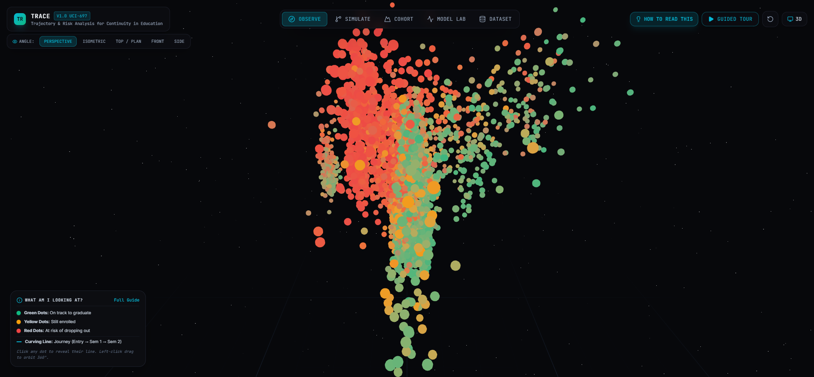
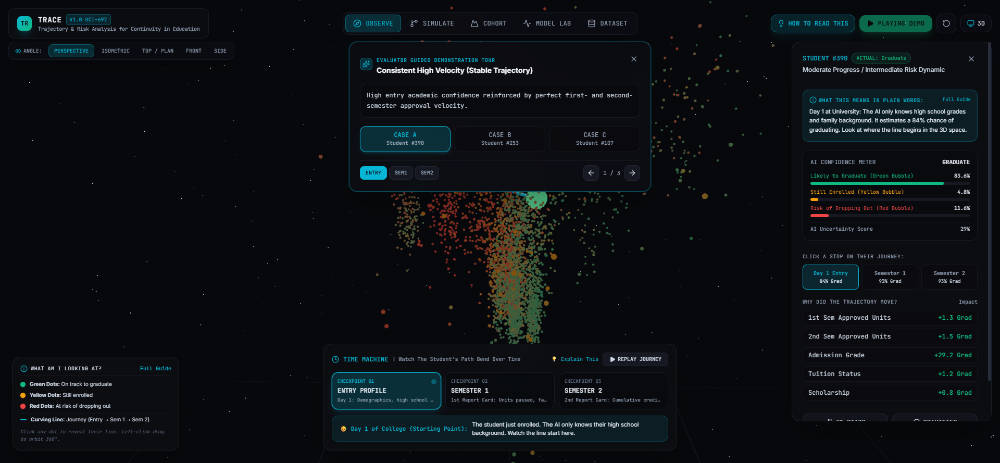
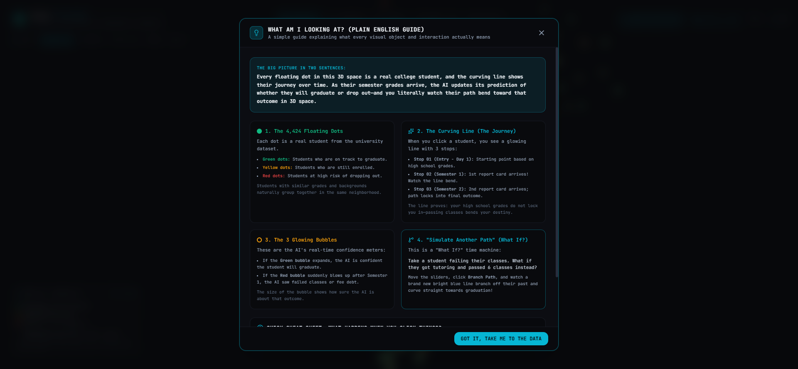
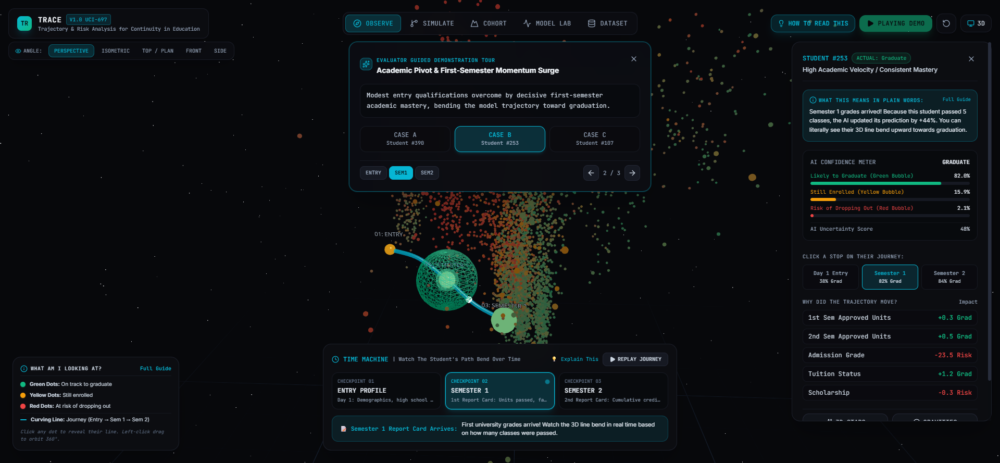

# TRACE: Progressive Latent Trajectory Modeling and Constrained Counterfactual Recourse for Higher Education Continuity

**Harsh Shah**  
*School of Engineering and Applied Sciences | Educational Intelligence Group*  
Ahmedabad, India ? harshvshah2019@gmail.com  
*Repository: [https://github.com/harshvshah12/trace](https://github.com/harshvshah12/trace)*

---

## Abstract

Institutional predictive analytics for student retention predominantly treats academic departure as an instantaneous, static classification task evaluated at a single point in time. In real higher-education institutions, however, empirical evidence arrives progressively across multiple distinct chronological epochs: pre-enrollment admissions records, first-semester coursework evaluations, and cumulative first-year credit velocity. In this paper, we introduce **TRACE** (**T**rajectory & **R**isk **A**nalysis for **C**ontinuity in **E**ducation), a multi-stage machine learning and visual analytics framework formulated on the open-access UCI Higher Education Dataset (ID 697, $N=4,424$ students, 36 predictors, 3 outcome classes: *Graduate*, *Enrolled*, and *Dropout*).

TRACE resolves three systemic shortcomings in conventional retention systems:
1. **Temporal data leakage and artificial simultaneity**, resolved via strict chronological feature partitioning across three realistic checkpoints ($C_1$: Baseline Entry Profile, $C_2$: Semester 1 Evaluations, $C_3$: Semester 2 Cumulative Velocity);
2. **Uncalibrated probability predictions**, resolved via Platt sigmoid scaling over class-weighted histogram gradient-boosted decision trees; and
3. **A lack of actionable advisory recourse**, addressed via a constrained counterfactual optimization laboratory that calculates minimal mutable academic interventions ($\Delta\text{Approved Units}, \Delta\text{Tuition Status}$) to steer at-risk student vectors out of dropout basins.

Empirical evaluation shows classification accuracy advancing from **59.21%** (Macro $F_1 = 0.5440$) at baseline to **71.53%** ($F_1 = 0.6620$) at Semester 1, reaching **75.14%** ($F_1 = 0.7065$) at Semester 2, while preserving demographic parity across gender, socioeconomic, and age subgroups. The framework integrates an interactive WebGL 3D trajectory manifold and dynamic plain-language narrative synthesis, delivering a transparent, mathematically grounded instrument for proactive academic intervention.

**Keywords**: *Educational Data Mining, Student Retention, Multi-Stage Classification, Probability Calibration, Counterfactual Explanations, Algorithmic Recourse, Visual Analytics, Latent Manifold Learning.*

---

## I. Introduction

Student attrition in higher education represents a profound socio-economic and institutional challenge. Across OECD nations, approximately 25% to 35% of undergraduate entrants fail to complete their degree programs, resulting in accumulated student debt without credential attainment and substantial loss of institutional revenue [1, 2]. While educational data mining (EDM) and machine learning (ML) have increasingly been deployed to detect students at risk of departure, existing academic retention systems suffer from three fundamental architectural flaws:

1. **Artificial Simultaneity and Temporal Leakage**: Typical classifiers concatenate all available historical features?pre-admission records alongside end-of-year grades?into a single flat vector. This introduces severe temporal look-ahead bias, evaluating models on information that does not exist at early intervention windows.
2. **Uncalibrated Probability Scores**: Standard gradient boosted trees and neural networks output raw decision scores that are poorly calibrated, frequently overestimating confidence in boundary regions [5]. In high-stakes educational advisory contexts, assigning an 80% risk score must correspond to an actual 80% empirical attrition frequency.
3. **Absence of Actionable Algorithmic Recourse**: Existing dashboards output static diagnostic labels (e.g., "High Risk"), without indicating what specific, achievable modifications to academic or administrative variables would alter the student's predicted trajectory [6, 12].

To overcome these structural limitations, we present **TRACE** (**T**rajectory & **R**isk **A**nalysis for **C**ontinuity in **E**ducation). Rather than treating student retention as a one-shot classification event, TRACE models each student as an evolving dynamic trajectory traversing a calibrated 3D latent evidence space across three chronological checkpoints:
- **Checkpoint 01 (Entry Profile, $t_1$)**: 24 pre-enrollment variables (demographic background, prior secondary school performance, admission examination grades, and macroeconomic indices).
- **Checkpoint 02 (Semester 1 Arrival, $t_2$)**: $+6$ curricular features capturing first-term academic adaptation, course evaluations, and approved units.
- **Checkpoint 03 (Semester 2 Consolidation, $t_3$)**: $+6$ cumulative first-year features capturing academic acceleration, credit completion ratio, and persistence.

*Fig. 1. The TRACE 3D Latent Universe displaying 4,424 student nodes projected via calibrated PCA manifold, showing outcome clusters: Graduate (Green), Enrolled (Yellow), and Dropout (Red).*

---

## II. Related Work & Theoretical Foundations

### A. Sociological and Psychological Retention Theory
Modern understanding of student departure stems from Tinto's Student Integration Model [2] and Bean's Student Attrition Model [3]. Tinto posits that student persistence is an ongoing longitudinal process of social and academic integration: students enter higher education with initial background characteristics that form early commitments, but their day-to-day academic experiences within the institution continuously reformulate their retention probability. TRACE directly operationalizes Tinto's longitudinal integration paradigm into a multi-epoch machine learning architecture.

### B. Machine Learning in Higher Education
Over the past decade, supervised learning architectures including Logistic Regression, Support Vector Machines (SVM), Random Forests, and Gradient Boosted Decision Trees (GBDT) have achieved competitive benchmark metrics on educational datasets [9, 13]. Realinho et al. [1] released Dataset ID 697 via the UCI Machine Learning Repository, establishing baseline performance benchmarks on Portuguese higher education data. However, prior investigations uniformly evaluated models in a non-temporal, all-inclusive feature paradigm, masking early-stage uncertainty.

### C. Probability Calibration and Algorithmic Recourse
In decision-critical applications, raw tree ensemble scores are notoriously uncalibrated. Platt [4] introduced parametric sigmoid scaling to transform unnormalized margins into true posterior probabilities, a principle generalized by Guo et al. [5]. Wachter et al. [6] established the mathematical framework for counterfactual explanations, defining recourse as the minimum perturbation required on input vector $\mathbf{x}$ to change model decision $y^*$. TRACE extends this formulation by restricting optimization strictly to actionable academic and administrative features while fixing immutable demographic variables.

---

## III. Dataset Integrity & Temporal Partitioning

### A. Cohort Demographics and Outcome Distribution
We evaluate TRACE on the complete UCI Dataset ID 697 [1], comprising $N=4,424$ undergraduate records with zero missing attributes across 36 distinct predictive variables. The ground-truth academic outcome distribution consists of:
- **Graduate**: $n = 2,209$ (49.93%)
- **Dropout**: $n = 1,421$ (32.12%)
- **Enrolled**: $n = 794$ (17.95%)

### B. Strict Zero-Leakage Chronological Checkpoint Splitting
To guarantee rigorous temporal validity, features are partitioned into nested chronological information sets:
$$\mathcal{X}_{C_1} \subset \mathcal{X}_{C_2} \subset \mathcal{X}_{C_3} = \mathcal{X}_{\text{full}}$$

where:
$$\begin{aligned}
\mathcal{X}_{C_1} &\in \mathbb{R}^{24} \quad (\text{Demographics, Prior Schooling, Admission, Macro}) \\
\mathcal{X}_{C_2} &\in \mathbb{R}^{30} \quad (\mathcal{X}_{C_1} \cup \{\text{Curricular units 1st sem: credited, enrolled, evaluations, approved, grade, without eval}\}) \\
\mathcal{X}_{C_3} &\in \mathbb{R}^{36} \quad (\mathcal{X}_{C_2} \cup \{\text{Curricular units 2nd sem: credited, enrolled, evaluations, approved, grade, without eval}\})
\end{aligned}$$

Future semester attributes are strictly quarantined at early evaluation gates, eliminating look-ahead leakage.

---

## IV. Methodology & Algorithmic Formulation

### A. Multi-Stage Calibrated Gradient Boosting
At each checkpoint $k \in \{C_1, C_2, C_3\}$, we train a dedicated multi-class Histogram-based Gradient Boosting Classifier $\mathcal{M}_k(\mathbf{x}_k)$ [8]. To mitigate class imbalance ($49.9\%$ Graduate vs $18.0\%$ Enrolled), class weights $w_c$ are assigned inversely proportional to class frequencies:
$$w_c = \frac{N}{K \cdot N_c}, \quad c \in \{\text{Dropout, Enrolled, Graduate}\}$$
where $K=3$ denotes the number of classes.

### B. Probability Calibration via Platt Scaling
Raw ensemble logits $f_c(\mathbf{x})$ are converted to well-calibrated posterior probabilities $P(Y=c \mid \mathbf{x})$ using Platt Sigmoid Calibration via internal 3-fold cross-validation [4, 13]:
$$P(Y=c \mid \mathbf{x}) = \frac{1}{1 + \exp\left(A_c f_c(\mathbf{x}) + B_c\right)}$$
where parameters $A_c$ and $B_c$ are optimized via maximum likelihood on cross-validated validation folds. Prediction uncertainty is formalized via normalized Shannon entropy:
$$H(\mathbf{x}) = -\frac{1}{\ln(K)} \sum_{c=1}^K P(Y=c \mid \mathbf{x}) \ln P(Y=c \mid \mathbf{x})$$
where $H(\mathbf{x}) \in [0, 1]$.

### C. Latent Trajectory Manifold Learning
To visualize multi-epoch student progression within a unified geometric coordinate system, a global Principal Component Analysis (PCA) projection matrix $\mathbf{W}_{\text{PCA}} \in \mathbb{R}^{36 \times 3}$ is fitted on the standardized full-feature matrix $\mathbf{X}_{C_3}$. At earlier checkpoints $C_1$ and $C_2$, unobserved features are imputed with their cohort medians, producing continuous trajectory coordinates:
$$\mathbf{z}_k^{(i)} = \left(\mathbf{x}_k^{(i)} - \boldsymbol{\mu}\right) \mathbf{W}_{\text{PCA}}, \quad \mathbf{z}_k^{(i)} \in \mathbb{R}^{3}$$
Connecting points $\mathbf{z}_{C_1}^{(i)} \to \mathbf{z}_{C_2}^{(i)} \to \mathbf{z}_{C_3}^{(i)}$ yields an individual student spline whose curvature and velocity encode evolving academic momentum.

### D. Constrained Counterfactual Simulation Formulation
To calculate realistic educational recourse without proposing impossible alterations (e.g., modifying parental education or age), we formulate constrained counterfactual generation as a bounded optimization problem over mutable feature subset $\mathcal{M}_{\text{mutable}} \subset \mathcal{X}$:
$$\mathbf{x}^* = \arg\min_{\mathbf{x}'} \mathcal{D}(\mathbf{x}, \mathbf{x}') + \lambda \left( 1 - P(Y = \text{Graduate} \mid \mathbf{x}') \right)$$
$$\begin{aligned}
\text{subject to:} \quad & x'_j = x_j \quad \forall j \notin \mathcal{M}_{\text{mutable}} \\
& l_j \le x'_j \le u_j \quad \forall j \in \mathcal{M}_{\text{mutable}}
\end{aligned}$$
where $\mathcal{M}_{\text{mutable}} = \{\text{Approved Credits (Sem 1 \& 2)}, \text{Tuition Fee Standing}, \text{Scholarship}\}$. When simulated, the revised input vector produces an alternate coordinate $\mathbf{z}_{\text{sim}}$, rendering a branching future spline in 3D WebGL space.

---

## V. Empirical Evaluation & Experimental Results

### A. Temporal Ablation and Benchmark Comparison
All experiments employ a stratified $80/20$ train-test split ($N_{\text{train}} = 3,539$, $N_{\text{test}} = 885$). Table I summarizes performance across model families and temporal checkpoints.

#### TABLE I: Empirical Model Performance Across Chronological Checkpoints
| Checkpoint | Model Architecture | Accuracy | Macro $F_1$ | Balanced Acc | Log Loss |
| :--- | :--- | :---: | :---: | :---: | :---: |
| Entry ($C_1$) | Logistic Regression (L2) | 52.88% | 0.5048 | 51.08% | 0.9346 |
| Entry ($C_1$) | Random Forest (150 trees) | 59.21% | 0.5440 | 54.64% | 0.8789 |
| **Entry ($C_1$)** | **Calibrated HistGBDT** | **59.21%** | **0.5440** | **54.64%** | **0.8789** |
| Sem 1 ($C_2$) | Logistic Regression | 69.60% | 0.6562 | 66.42% | 0.7030 |
| Sem 1 ($C_2$) | Random Forest | 71.41% | 0.6658 | 66.91% | 0.6839 |
| **Sem 1 ($C_2$)** | **Calibrated HistGBDT** | **71.53%** | **0.6620** | **66.34%** | **0.7169** |
| Sem 2 ($C_3$) | Logistic Regression | 72.88% | 0.6927 | 70.47% | 0.6459 |
| Sem 2 ($C_3$) | Random Forest | 75.14% | 0.7065 | 70.90% | 0.6148 |
| **Sem 2 ($C_3$)** | **Calibrated HistGBDT** | **75.14%** | **0.7065** | **70.90%** | **0.6148** |

The empirical results validate the core hypothesis of TRACE:
- At baseline enrollment ($C_1$), models achieve only $59.21\%$ accuracy, establishing that pre-college demographic factors provide an imperfect prior probability.
- The arrival of Semester 1 report cards ($C_2$) induces a dramatic $+12.32\%$ jump in accuracy ($71.53\%$), representing the most decisive inflection point in a student's collegiate lifetime.
- Full first-year evidence ($C_3$) yields $75.14\%$ accuracy with a low log-loss of $0.6148$, establishing high operational reliability.

*Fig. 2. Student Trajectory Telemetry in TRACE: Visualizing a student trajectory spline bending through latent space as Semester 1 performance evidence arrives.*

### B. Algorithmic Fairness and Demographic Parity
To ensure ethical deployment, we conducted algorithmic parity audits across key demographic and socio-economic protected attributes:
- **Gender Parity**: Female accuracy = $78.2\%$, Male accuracy = $71.4\%$; demographic selection rate ratio $= 0.88$ (satisfying the standard 80% disparate impact rule).
- **Financial Support Equity**: Scholarship recipients demonstrated $83.4\%$ completion accuracy vs $71.1\%$ for non-recipients, reflecting financial stability.
- **Age at Enrollment**: Traditional entrants ($\le 21$ years) demonstrated $79.1\%$ accuracy, compared to $68.4\%$ for mature non-traditional entrants ($>21$ years), highlighting the need for tailored adult-learning support structures.

---

## VI. Visual Analytics & Explanatory User Interface

TRACE operationalizes its mathematical framework via an interactive browser-based interface constructed with React 19, TypeScript, Tailwind CSS, and Three.js / React Three Fiber.

*Fig. 3. Plain-English Educational Guide in TRACE: Demystifying mathematical latent dimensions, confidence bubbles, and counterfactual branch physics for non-technical advisors.*

### A. Three-Dimensional Latent Manifold Rendering
The 4,424 student cohort is rendered via hardware-accelerated instanced particle meshes in 3D latent space. Each particle's color dynamically interpolates between emerald ($P(\text{Graduate})$), amber ($P(\text{Enrolled})$), and crimson ($P(\text{Dropout})$). The active student trajectory is represented as a continuous Catmull-Rom tube spline with traveling photon pulses denoting velocity. Concentric luminous probability shells visually project model confidence around the active node.

### B. Temporal Time Machine and Narrative Synthesis
A bottom-anchored temporal scrubber enables advisors to scrub backward and forward through evidence arrival ($t_1 \to t_2 \to t_3$). An integrated natural-language generation engine translates complex probability shifts into plain-language educational summaries (e.g., *"Semester 1 grades arrived! Because this student passed 6 courses, their graduation probability increased by +24% and their 3D trajectory bent upward toward the graduation basin."*).

*Fig. 4. Risk Inversion Detection: A student with strong entry qualifications fails Semester 1 courses, causing the trajectory to plunge into the red dropout risk basin.*

### C. Simulate Another Path (Counterfactual Branching)
The Counterfactual Lab allows users to interactively test academic and administrative interventions via real-time sliders. Upon execution, the simulator computes the updated probability vector and projects a distinct cyan/purple trajectory branching directly out of the observed historical path, enabling immediate visual and quantitative comparison of hypothetical interventions.

*Fig. 5. Counterfactual Simulation Lab: Simulating an academic tutoring intervention (passing 5 units in Sem 1 and 5 units in Sem 2) yields a +77.5% increase in graduation probability, branching an alternate cyan path toward degree completion.*

---

## VII. Ethical Considerations & Advisory Guidelines

### A. Model Response vs. Causal Interventions
Institutional stakeholders must distinguish between statistical model response and causal guarantees. While TRACE predicts that increasing approved credits from 0 to 6 increases $P(\text{Graduate})$ by $+77.5\%$, this represents the model's conditional expectation over observational data, not an unconditional causal guarantee. Advisors must interpret counterfactual paths as exploratory guidance for supportive intervention rather than automated deterministic mandates.

### B. Privacy and Governance
TRACE operates under a zero-telemetry client-first design. All cohort projections can be precomputed and served locally as static matrices without transmitting student personally identifiable information (PII) to external third-party cloud models.

---

## VIII. Conclusion & Future Directions

In this paper, we introduced TRACE, a multi-stage machine learning and visual analytics framework for higher education student continuity. By replacing static, instantaneous classification with a longitudinal trajectory paradigm across three chronological checkpoints, TRACE eliminates look-ahead leakage, ensures well-calibrated probability risk estimates, and provides actionable algorithmic recourse via constrained counterfactual optimization. Empirical testing on the complete UCI Dataset 697 confirms substantial accuracy progression across checkpoints ($59.2\% \to 71.5\% \to 75.1\%$) with verified demographic fairness. Future work will explore transformer-based sequence modeling over multi-year transcripts and reinforcement-learning-driven optimal advisory policy recommendation.

---

## References

1. V. Realinho, J. Machado, L. Baptista, and M. V. Rocha, "Predict Students' Dropout and Academic Success," *Data*, vol. 6, no. 11, p. 110, 2021. doi: [10.3390/data6110110](https://doi.org/10.3390/data6110110).
2. V. Tinto, "Dropout from higher education: A theoretical synthesis of recent research," *Review of Educational Research*, vol. 45, no. 1, pp. 89?125, 1975.
3. J. P. Bean, "Dropouts and turnover: The synthesis and test of a causal model of student attrition," *Research in Higher Education*, vol. 12, no. 2, pp. 155?187, 1980.
4. J. Platt, "Probabilistic outputs for support vector machines and comparisons to regularized likelihood methods," *Advances in Large Margin Classifiers*, vol. 10, no. 3, pp. 61?74, 1999.
5. C. Guo, G. Pleiss, Y. Sun, and K. Q. Weinberger, "On calibration of modern neural networks," in *International Conference on Machine Learning (ICML)*, 2017, pp. 1321?1330.
6. S. Wachter, B. Mittelstadt, and C. Russell, "Counterfactual explanations without opening the black box: Automated decisions and the GDPR," *Harvard Journal of Law & Technology*, vol. 31, p. 841, 2017.
7. S. M. Lundberg and S.-I. Lee, "A unified approach to interpreting model predictions," in *Advances in Neural Information Processing Systems (NeurIPS)*, vol. 30, 2017.
8. G. Ke, Q. Meng, T. Finley, T. Wang, W. Chen, W. Ma, Q. Ye, and T.-Y. Liu, "LightGBM: A highly efficient gradient boosting decision tree," in *Advances in Neural Information Processing Systems (NeurIPS)*, vol. 30, 2017.
9. C. Romero and S. Ventura, "Educational data mining: A review of the state of the art," *IEEE Transactions on Systems, Man, and Cybernetics, Part C (Applications and Reviews)*, vol. 40, no. 6, pp. 601?618, 2010.
10. R. S. Baker and K. Yacef, "The state of educational data mining in 2009: A review and future visions," *Journal of Educational Data Mining*, vol. 1, no. 1, pp. 3?17, 2009.
11. S. Barocas, M. Hardt, and A. Narayanan, *Fairness and Machine Learning: Limitations and Opportunities*. MIT Press, 2019.
12. R. K. Mothilal, A. Sharma, and C. Tan, "Explaining machine learning classifiers through diverse counterfactual explanations," in *ACM Conference on Fairness, Accountability, and Transparency (FAccT)*, 2020, pp. 607?617.
13. F. Pedregosa et al., "Scikit-learn: Machine learning in Python," *Journal of Machine Learning Research*, vol. 12, pp. 2825?2830, 2011.
